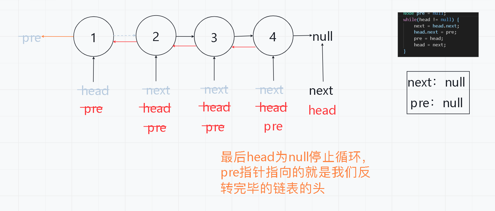
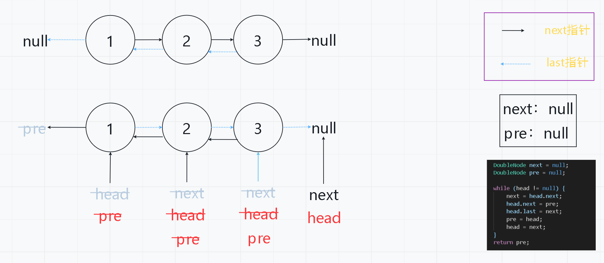

## 基础链表反转问题

- 单链表反转


- 双链表反转

```java
public class Code01_ReverseList {

    //单链表 只有一个指针
	public static class Node{
		public int value;
		public Node next;
		
		public Node(int data) {
			value = data;
		}
	}
	// 双链表 存在两个指针
	public static class DoubleNode{
		public int value;
		public DoubleNode last;
		public DoubleNode next;
		
		public DoubleNode(int data) {
			value = data;
		}
	}
	
	/**
        单链表反转：
        两个指针，next指针用来记录头指针的下一个指针，
        pre指针用来记录已经反转好的链表    
    */
	public static Node reverseLinkedList(Node head) {
		
		Node next = null;
		Node pre = null;
		while(head != null) {
			next = head.next;
			head.next = pre;
			pre = head;
			head = next;
		}
		
		return pre;
	}
	
    /**
        双链表反转：
        两个指针，next指针用来记录头指针的下一个指针，
        pre指针用来记录已经反转好的链表，比单链表多一步，
        在反转的过程中也要把last指针反转    
    */
	public static DoubleNode reverseDoubleLinkedList(DoubleNode head) {
		DoubleNode next = null;
		DoubleNode pre = null;
		
		while (head != null) {
			next = head.next;
			head.next = pre;
			head.last = next;
			pre = head;
			head = next;
		}
		return pre;
	}
	
}
```