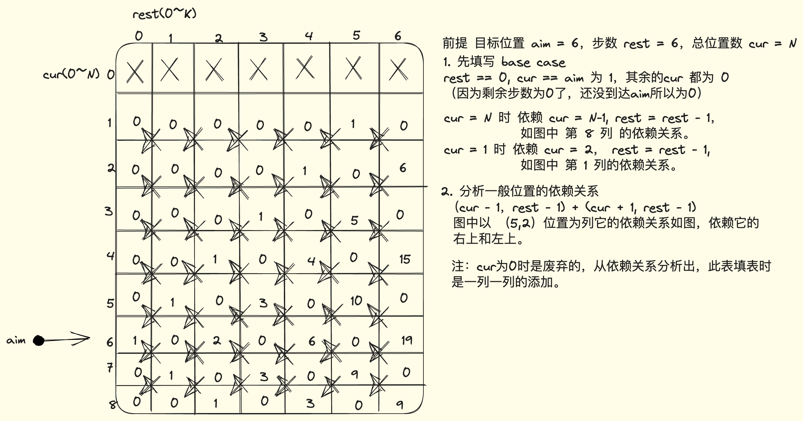
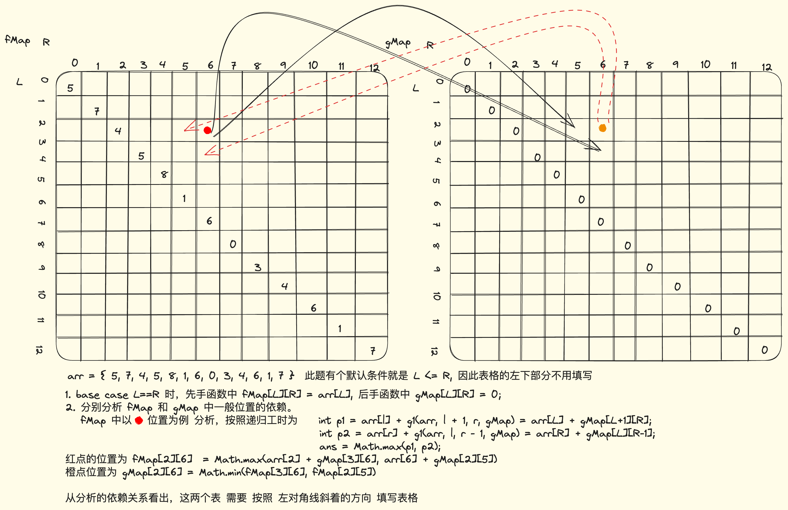

# 模型总结

## 1. 从左往右的尝试模型

## 2. 范围尝试模型

## 3. 样本对应模型-一个样本做行，一个样本做列
最长公共子序列

## 4. 业务限制模型
给定一个数组arr，arr[i]代表第i号咖啡机泡一杯咖啡的时间
给定一个正数N，表示N个人等着咖啡机泡咖啡，每台咖啡机只能轮流泡咖啡
只有一台洗咖啡机，一次只能洗一个杯子，时间耗费a，洗完才能洗下一杯
每个咖啡杯也可以自己挥发干净，时间耗费b，咖啡杯可以并行挥发
假设所有人拿到咖啡之后立刻喝干净，
返回从开始等到所有咖啡杯变干净的最短时间
三个参数：int[] arr、int N，int a、int b